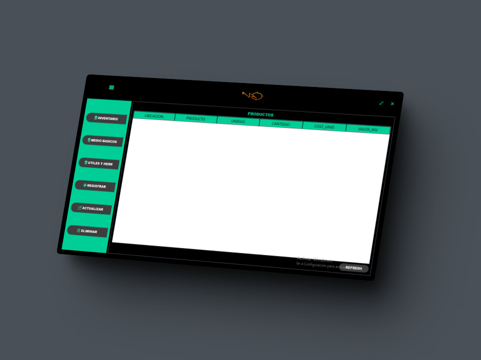

# Nao
Desktop application made with Python and SQL language, using the PyQt library for the design and implementation of the graphical user interface and MySql as a database management system for the complete management of the Nao bar-restaurant business

## Tools
Python - Programming Language  
PyQt - UI Library  
MySQL - DataBase  

## Preview

